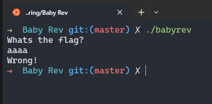
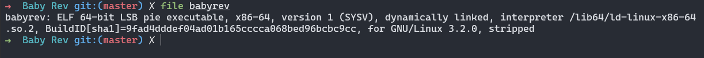
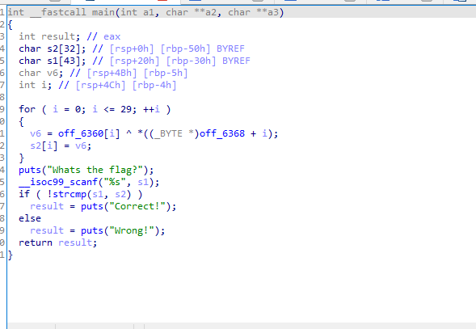
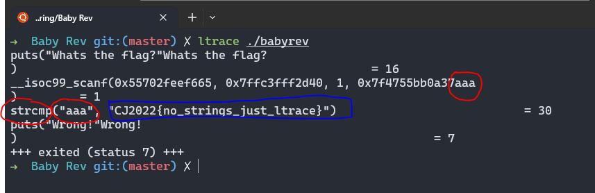

<div align = center>

# **BABY REV**
</div>

```
Author : lunashci

Diberikan tantangan untuk memecahkan metadata dari hasil decompiled sebuah program dengan header ELF

```
- **soal**
  
  Intro Bois : [source soal](../Baby%20Rev/babyrev)

- **Tools yang digunakan**
   1. Terminal(zsh shell)
   2. ltrace
   3. idaPro(commercial) // u can use free edition
   

- **penjelasan**
  
setelah mendapatkan soal, saya mencoba untuk menjalankannya terlebih dahulu, dan ternyata cara kerja program ini cukup mudah.



Tapi sebelum menganalisa lebih jauh kami akan memeriksa header metadata dengan command **files**.



ternyata adalah sebuah file binary yang harus kita analisa menggunakn ida, karna agak tidak memperpanjang dokumentasi, untuk penjelasan elf file silahkan [lihat pejelasan disini](https://en.wikipedia.org/wikiExecutable_and_Linkable_Format)

setelah itu kami langsung saja melalukan decompile file dengan ida pro. dan terlihat hasil berikut :

mudahnya ketika program di eksekusi, program akan langsung memunculkan string untuk memasukkan sebuah flag/password, nantinya string yang kita inputkan. Akan di compare dengan strcmp. asumsi penulis, hal ini bisa langsung kita coba untuk melakukan trace pada program, dengan menggunakan tool **ltrace** pada program, guna mengetahui inputan kita akan di compare dengan apa.



- red "aaa" = inputan saya
- red "strcmp" = fungsi yang membandingkan 2 string tiap karakter
- red "aaa" = inputan kita yang sedang di bandingkan
- blue "CJ2022(no_strings_just_ltrace)" = string pembanding
  
setelah di lakukannya ltrace pada program tadi, didapatkannya lah, bahwa ketika program berjalan. dia akan mencompare string yang kita inputkan dengan flag yang kita cari.
